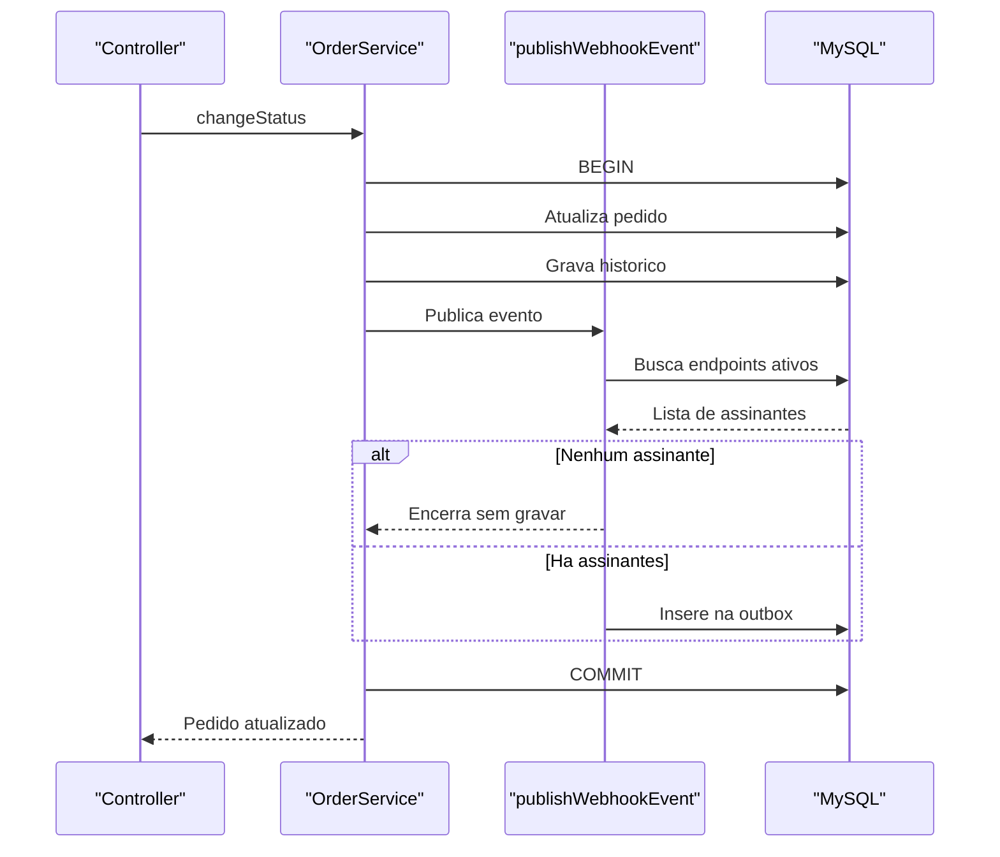
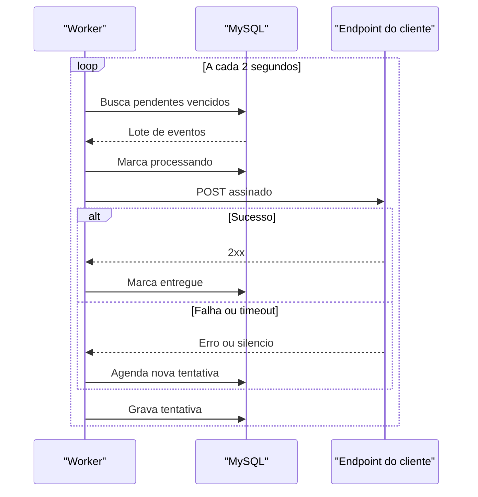
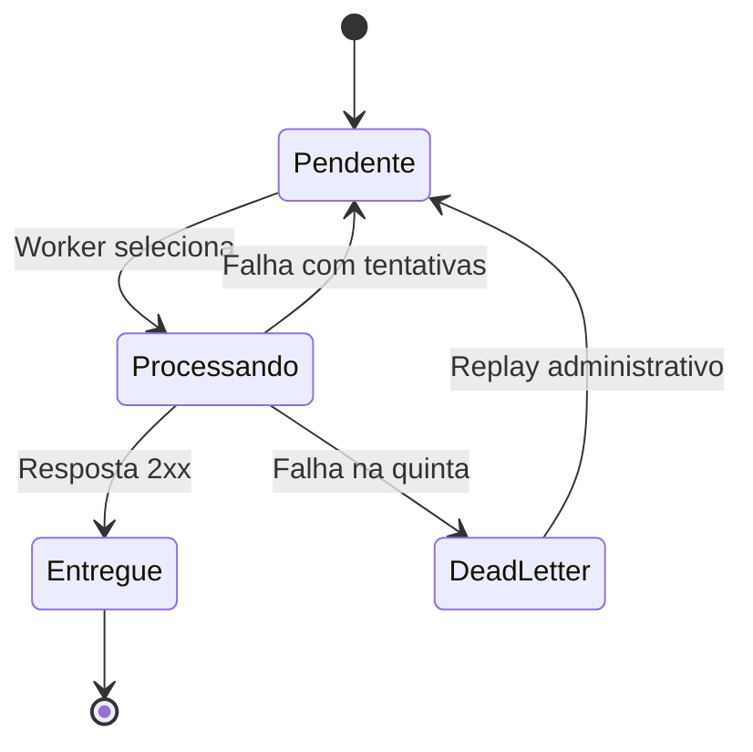
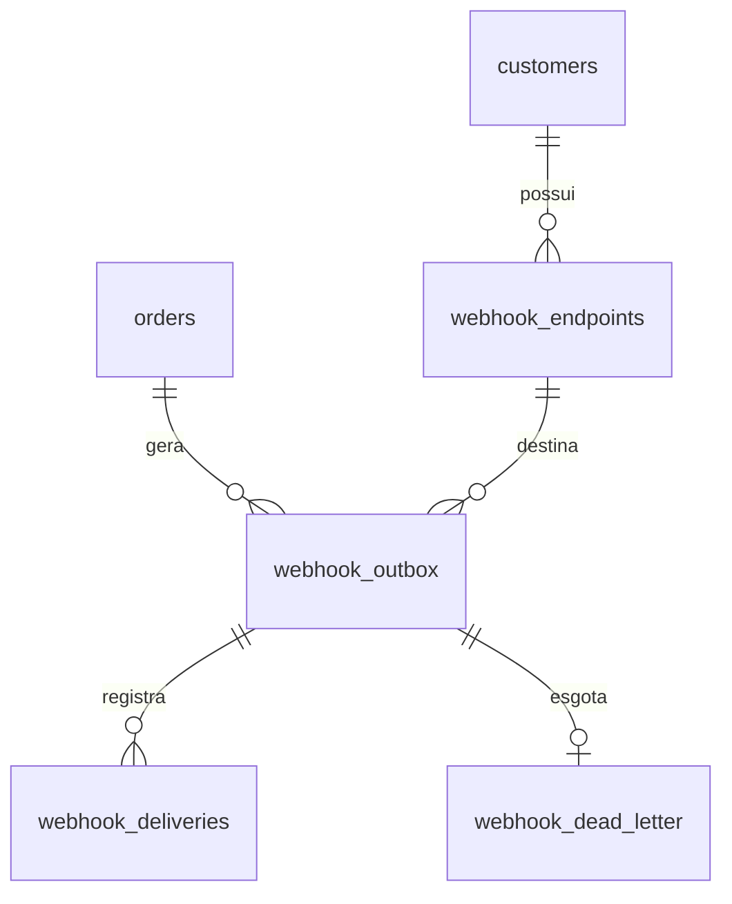

### FDD: Sistema de Webhooks de Notificação de Pedidos

Versão: 1.0
Data: 2026-07-29
Responsável: Larissa (Tech Lead), com revisão técnica de Bruno e Diego

> Este documento especifica a implementação da feature proposta em [`RFC.md`](RFC.md), sobre as decisões formalizadas em [`docs/adrs/`](adrs/README.md). Referências no formato `[hh:mm]` remetem a [`TRANSCRICAO.md`](../TRANSCRICAO.md), na raiz do repositório; referências no formato `caminho/arquivo.ext:linha` remetem ao código deste repositório. Nomes de tabela, coluna, rota e código de erro que não foram ditos na reunião são decisões de desenho desta especificação e estão marcados como tal na primeira vez que aparecem.

---

### 1. Contexto e motivação técnica

A aplicação é um Order Management System em Node.js e TypeScript, com Express, Prisma sobre MySQL e cinco módulos de domínio (`auth`, `users`, `customers`, `products`, `orders`). Ela não tem hoje nenhum mecanismo de notificação externa, evento, fila ou processo de execução contínua.

O ciclo de vida do pedido é controlado por uma máquina de estados fechada, declarada em `src/modules/orders/order.status.ts:3`, com seis estados e transições fixas. A mudança de status acontece dentro de uma transação em `src/modules/orders/order.service.ts:131`, que hoje executa cinco operações: lê o pedido com seus itens, movimenta o estoque quando a transição exige, atualiza o status, grava o histórico e relê o pedido com as relações que devolve ao chamador.

A motivação técnica da feature é o problema de *dual write*. Notificar um sistema externo a partir dessa transação, por chamada HTTP direta, cria duas escritas em recursos diferentes sem transação comum. A solução adotada é o padrão Transactional Outbox: o evento vira uma linha gravada dentro da mesma transação, e a entrega passa a ser trabalho de um processo separado.

Três características do código existente moldam a implementação:

- **Não há processo de execução contínua.** O único ponto de entrada é `src/server.ts:6`, que sobe o servidor HTTP e encerra o cliente de banco no desligamento. O worker da outbox é o primeiro processo do projeto que não atende requisição.
- **O cliente de banco é uma instância por processo**, criada em `src/config/database.ts:10`. O worker abre a sua, com a mesma string de conexão `[09:30]`.
- **O padrão de teste é único**: ponta a ponta contra a aplicação e o banco reais, com limpeza de tabelas antes de cada caso em `tests/setup.ts:8`. O ciclo do worker não é uma requisição HTTP e não cabe nesse molde sem adaptação.

---

### 2. Objetivos técnicos

1. Garantir que nenhuma mudança de status commitada exista sem o evento correspondente registrado, quando houver ao menos um endpoint interessado naquela transição.
2. Entregar o evento ao endpoint do cliente em até 2 segundos após o commit, no caminho sem falha, contra a expectativa de 10 segundos informada pelos clientes `[09:02]`.
3. Tolerar indisponibilidade do endpoint de destino por até quase 15 horas sem perda de evento e sem intervenção humana.
4. Permitir que o cliente verifique origem e integridade de cada evento recebido, sem que a plataforma dependa do ambiente dele.
5. Manter o evento coerente com o instante do fato que ele anuncia, independente do atraso de entrega.
6. Não introduzir nenhuma dependência nova no projeto `[09:29]` e conter a alteração de comportamento em um único ponto do código existente, a transação de mudança de status `[09:40]`.
7. Deixar toda falha permanente de entrega diagnosticável e reprocessável por operação auditada.

---

### 3. Escopo e exclusões

**Incluído**

- Módulo `src/modules/webhooks` com a composição padrão do projeto: controller, service, repository, routes e schemas.
- Quatro tabelas novas: configuração de endpoint, outbox de eventos, histórico de entregas e dead letter.
- Sete endpoints HTTP: CRUD de configuração (4), rotação de secret (1), histórico de entregas (1) e reprocessamento administrativo de dead letter (1).
- Contrato de saída: a requisição HTTP assinada que a plataforma envia ao endpoint do cliente.
- Segundo ponto de entrada de processo, `src/worker.ts`, e script de execução correspondente `[09:11]`.
- Função de publicação chamada de dentro da transação de mudança de status `[09:41]`.
- Assinatura HMAC-SHA256 e rotação de secret com sobreposição de 24 horas.
- Política de retry, dead letter e reprocessamento manual.

**Excluído**

- Webhooks de entrada. O escopo é exclusivamente outbound `[09:02]`.
- Aviso ativo ao cliente sobre integração quebrada, por e-mail ou outro canal. Adiado para fase seguinte `[09:37]`.
- Painel visual para o cliente. Projeto separado, do time de frontend `[09:40]`.
- Rate limiting de saída por cliente. Levantado e deixado em aberto `[09:39]`.
- Arquivamento e retenção das linhas já entregues `[09:08]`.
- Escala do worker além de uma instância `[09:13]`.
- Alteração de comportamento em qualquer módulo existente fora da transação de mudança de status. O tratador de erro, a autorização e os demais módulos de domínio ficam intocados. No logger, a única mudança é a lista de campos omitidos, tratada em 11.5, que não altera comportamento observável de nenhum fluxo existente.

---

### 4. Fluxos detalhados e diagramas

#### 4.1 Fluxo principal: emissão do evento

Acontece dentro da transação de `changeStatus`, imediatamente após a gravação do histórico de status.

1. A transação já validou a transição, movimentou o estoque quando aplicável, atualizou o pedido e gravou o histórico.
2. A função de publicação recebe a transação em curso, o pedido e os status de origem e destino.
3. Ela consulta os endpoints ativos do cliente daquele pedido que assinam o status de destino.
4. Se a consulta não retorna nenhum endpoint, a função termina sem gravar nada `[09:34]`.
5. Para cada endpoint encontrado, ela monta o conteúdo do evento a partir dos dados do pedido já em memória e insere uma linha na outbox, com estado pendente e contador de tentativas em zero.
6. O identificador do evento é gerado nesse ponto e não muda mais `[09:25]`.
7. Se o conteúdo montado ultrapassa 64KB, a função lança erro e a transação inteira é desfeita `[09:24]`.
8. A transação faz commit. O evento e a mudança de status passam a existir juntos, ou nenhum dos dois existe.



Notas:

- A busca de assinantes usa a mesma transação, portanto lê a configuração vigente no instante da mudança. A assinatura da função de publicação está em 11.1.
- Uma falha em qualquer passo da publicação desfaz a mudança de status. É o comportamento exigido em `[09:40]`.

#### 4.2 Fluxo principal: entrega pelo worker

O ciclo se repete a cada 2 segundos, indefinidamente, em processo próprio.

1. O worker seleciona até 20 eventos pendentes cuja hora de próxima tentativa já passou, ordenados por data de criação. O tamanho do lote é decisão de desenho desta especificação, justificada em 6.2.
2. Para cada evento, marca o estado como processando, para que uma parada abrupta deixe rastro de qual evento estava sendo enviado.
3. Monta a requisição: o conteúdo persistido como corpo, e os cabeçalhos de identificação, assinatura e horário.
4. Calcula a assinatura HMAC-SHA256 sobre os bytes exatos do corpo, com a secret vigente do endpoint.
5. Envia com tempo limite de 10 segundos `[09:42]`.
6. Grava uma linha no histórico de entregas com o resultado, o código de status recebido, o corpo da resposta e a duração `[09:34]`.
7. Resposta com status de sucesso marca o evento como entregue e encerra.
8. Qualquer outro desfecho conta como falha e segue para o fluxo de retry.



Notas:

- Enquanto o worker for único, a ordem de leitura por data de criação entrega ordenação por pedido `[09:12]`.
- O worker não reavalia a assinatura nem o estado ativo do cadastro. Se a linha existe na outbox, ela é entregue. É a consequência direta de filtrar na inserção, registrada em [ADR-008](adrs/ADR-008-filtro-de-eventos-na-insercao.md).
- Decisão de desenho: ao iniciar, o worker devolve ao estado pendente toda linha que ficou em processando, porque a única forma de uma linha estar nesse estado com o worker parado é interrupção no meio de um ciclo. Sem essa varredura, uma parada abrupta deixaria eventos presos fora da seleção de pendentes.

#### 4.3 Fluxo de exceção: retry e dead letter

1. Na falha, o contador de tentativas é incrementado.
2. Se o contador chegou a 5, o evento é movido para a dead letter, com o conteúdo, o motivo da falha e o horário `[09:18]`, e sai da fila ativa.
3. Se não chegou, o evento volta ao estado pendente com a hora da próxima tentativa calculada pela progressão fixa: 1 minuto, 5 minutos, 30 minutos, 2 horas e 12 horas `[09:17]`.
4. O worker só considera pendentes cuja hora de próxima tentativa já passou, de modo que o espaçamento é respeitado sem nenhum agendador externo.

Contam como falha: erro de conexão, ausência de resposta dentro de 10 segundos, e qualquer código de status fora da faixa de sucesso.



Notas:

- A transição de volta a pendente carrega a hora da próxima tentativa. Sem ela, o backoff não existe.
- O replay recoloca na outbox como pendente `[09:18]`, e essa é a única aresta de saída da dead letter.

#### 4.4 Fluxo de exceção: reprocessamento manual

1. Operador com papel administrativo chama o endpoint de replay, informando o identificador do item na dead letter.
2. A autorização é verificada pelo mecanismo de papel já existente `[09:36]`.
3. O item é reinserido na outbox como pendente `[09:18]`. Decisão de desenho: o contador de tentativas volta a zero e a hora da próxima tentativa fica vazia, de modo que o replay dá ao item um ciclo completo de 5 tentativas e ele é processado no ciclo seguinte do worker.
4. O identificador do evento é preservado, de modo que um cliente que já processou aquele evento consegue reconhecê-lo como repetição.
5. A operação emite registro de log estruturado com quem executou, para auditoria `[09:36]`.

#### 4.5 Modelo de dados



Os nomes `webhook_outbox` e `webhook_dead_letter` vieram da reunião `[09:06]` `[09:18]`. Os nomes `webhook_endpoints` e `webhook_deliveries` são decisão de desenho desta especificação, seguindo a convenção de nomes no plural em snake_case que o schema já usa.

**`webhook_endpoints`.** Identificador, cliente, URL de destino, secret vigente, secret anterior, expiração da secret anterior, lista de status assinados, estado ativo, data de criação e de atualização. A composição de campos vem de `[09:21]`, minuto em que Bruno enumera URL, secret, cliente e estado ativo, e em que Sofia acrescenta a rotação com sobreposição, que é o que exige os dois campos de secret anterior. Índice por cliente e por estado ativo, que é o par consultado dentro da transação de mudança de status.

**`webhook_outbox`.** Identificador, endpoint de destino, pedido de origem, tipo do evento, status de origem e destino, conteúdo do evento, estado, contador de tentativas, hora da próxima tentativa, motivo do último erro, data de criação e de entrega. Índice por estado e por data de criação `[09:08]`, mais índice pela hora da próxima tentativa, necessário para a seleção do lote.

**`webhook_deliveries`.** Identificador, evento de origem, número da tentativa, código de status recebido, corpo da resposta, duração em milissegundos, resultado e data. É o que sustenta o histórico pedido em `[09:34]`.

**`webhook_dead_letter`.** Identificador, evento de origem, endpoint, conteúdo, motivo da falha, contagem de tentativas, data de entrada e data de reprocessamento. Composição definida em `[09:18]`.

Convenções aplicadas às quatro tabelas, todas herdadas do schema existente: chave primária `String @id @default(uuid()) @db.Char(36)` `[09:51]`, `createdAt` com `@default(now())` em todas e `updatedAt` com `@updatedAt` apenas nas duas que sofrem atualização depois da criação, que são a de configuração de endpoint e a de outbox, mapeamento explícito com `@@map`, e o conteúdo do evento em coluna `Json`, precedente já usado em `prisma/schema.prisma:46`.

---

### 5. Contratos públicos

Todos os endpoints ficam sob o prefixo `/api/v1`, montado em `src/app.ts:67`, e exigem autenticação por token de portador, aplicada como no roteador de clientes em `src/modules/customers/customer.routes.ts:14`. O identificador do cliente vem no corpo ou no caminho, e não do token, porque o token representa o usuário operador `[09:32]`.

O envelope de erro é o que o tratador central já produz em `src/middlewares/error.middleware.ts:16`, e a listagem paginada segue `src/shared/http/response.ts:22`.

#### 5.1 Cadastrar endpoint de webhook

`POST /api/v1/webhooks`. Requer autenticação.

Requisição:

```json
{
  "customerId": "9f1c2d34-5b6a-4c7d-8e9f-0a1b2c3d4e5f",
  "url": "https://atlas-comercial.example.com/hooks/oms",
  "subscribedStatuses": ["SHIPPED", "DELIVERED"]
}
```

Resposta `201 Created`. A secret é gerada pela plataforma e devolvida na criação `[09:31]`, e devolvida de novo na rotação `[09:21]`. Decisão de desenho: em nenhuma outra resposta ela aparece, o que é a leitura direta da exigência de custódia de credencial de `[09:21]`. O prefixo `whsec_` do exemplo também é decisão de desenho, para tornar a credencial reconhecível em revisão de código do lado do cliente.

```json
{
  "data": {
    "id": "3a7b1c02-4d5e-4f60-9a8b-7c6d5e4f3a2b",
    "customerId": "9f1c2d34-5b6a-4c7d-8e9f-0a1b2c3d4e5f",
    "url": "https://atlas-comercial.example.com/hooks/oms",
    "subscribedStatuses": ["SHIPPED", "DELIVERED"],
    "active": true,
    "secret": "whsec_7f3a9c2e5b1d8406af2e9c7b3d5108ea",
    "createdAt": "2026-07-29T13:42:11.402Z"
  }
}
```

Status possíveis: `201`, `400` (URL sem TLS, lista de status inválida), `401`, `404` (cliente inexistente), `409` (URL já cadastrada para o mesmo cliente).

#### 5.2 Listar endpoints de um cliente

`GET /api/v1/webhooks?customerId=<uuid>&page=1&pageSize=20`. Requer autenticação.

Resposta `200 OK`, no formato paginado do projeto. A secret nunca aparece na listagem.

```json
{
  "data": [
    {
      "id": "3a7b1c02-4d5e-4f60-9a8b-7c6d5e4f3a2b",
      "customerId": "9f1c2d34-5b6a-4c7d-8e9f-0a1b2c3d4e5f",
      "url": "https://atlas-comercial.example.com/hooks/oms",
      "subscribedStatuses": ["SHIPPED", "DELIVERED"],
      "active": true,
      "createdAt": "2026-07-29T13:42:11.402Z"
    }
  ],
  "pagination": { "page": 1, "pageSize": 20, "total": 1, "totalPages": 1 }
}
```

Status possíveis: `200`, `400` (parâmetro de consulta inválido), `401`.

#### 5.3 Editar endpoint

`PATCH /api/v1/webhooks/:id`. Requer autenticação. Corpo parcial, seguindo o padrão de `updateCustomerSchema` em `src/modules/customers/customer.schemas.ts:23`.

Requisição:

```json
{
  "subscribedStatuses": ["PAID", "SHIPPED", "DELIVERED"],
  "active": false
}
```

Resposta `200 OK` com o cadastro atualizado, sem a secret:

```json
{
  "data": {
    "id": "3a7b1c02-4d5e-4f60-9a8b-7c6d5e4f3a2b",
    "customerId": "9f1c2d34-5b6a-4c7d-8e9f-0a1b2c3d4e5f",
    "url": "https://atlas-comercial.example.com/hooks/oms",
    "subscribedStatuses": ["PAID", "SHIPPED", "DELIVERED"],
    "active": false,
    "createdAt": "2026-07-29T13:42:11.402Z",
    "updatedAt": "2026-07-29T15:08:27.640Z"
  }
}
```

Status possíveis: `200`, `400` (lista de status inválida ou URL sem TLS), `401`, `404`, `409` (URL já cadastrada para o mesmo cliente).

A alteração vale para transições futuras. Eventos já na outbox continuam sendo entregues conforme a assinatura vigente no instante em que foram criados, consequência registrada em [ADR-008](adrs/ADR-008-filtro-de-eventos-na-insercao.md).

#### 5.4 Remover endpoint

`DELETE /api/v1/webhooks/:id`. Requer autenticação.

Resposta `204 No Content`, sem corpo.

Status possíveis: `204`, `401`, `404`.

Decisão de desenho: a remoção apaga junto os eventos daquele endpoint ainda na outbox, por `onDelete: Cascade` na relação, seguindo o padrão que o schema já usa para registros dependentes em `prisma/schema.prisma:125`. É coerente com a regra de que toda linha da outbox tem destinatário certo `[09:34]`: sem o cadastro, o evento não tem para onde ir. Quem quer apenas parar a emissão de eventos novos, preservando os já registrados, desativa o cadastro em vez de removê-lo.

#### 5.5 Rotacionar secret

`POST /api/v1/webhooks/:id/secret/rotate`. Requer autenticação. Sem corpo. O caminho é decisão de desenho desta especificação; a operação é a exigida em `[09:21]`.

Resposta `200 OK`:

```json
{
  "data": {
    "id": "3a7b1c02-4d5e-4f60-9a8b-7c6d5e4f3a2b",
    "secret": "whsec_1b4e09f7c2a83d5061fe7b9c4a2d8f30",
    "rotatedAt": "2026-08-04T09:15:44.120Z",
    "previousSecretExpiresAt": "2026-08-05T09:15:44.120Z"
  }
}
```

A secret anterior continua aceita por 24 horas contadas a partir da rotação `[09:21]`. Como a plataforma assina e o cliente verifica, a sobreposição significa que o worker passa a assinar com a nova secret imediatamente, e o campo de expiração informa ao cliente até quando ele pode manter a antiga configurada em paralelo.

Status possíveis: `200`, `401`, `404`, `409` (rotação pedida com uma sobreposição ainda em curso), `422` (cadastro desativado).

#### 5.6 Consultar histórico de entregas

`GET /api/v1/webhooks/:id/deliveries?page=1&pageSize=20`. Requer autenticação. Caminho definido em `[09:34]`.

Resposta `200 OK`:

```json
{
  "data": [
    {
      "id": "b2c3d4e5-f607-4819-a2b3-c4d5e6f70819",
      "eventId": "5c8e0a12-3b4d-4e5f-9a0b-1c2d3e4f5a6b",
      "attempt": 2,
      "result": "SUCCESS",
      "responseStatus": 200,
      "responseBody": "{\"received\":true}",
      "durationMs": 184,
      "attemptedAt": "2026-07-29T13:47:03.115Z"
    }
  ],
  "pagination": { "page": 1, "pageSize": 20, "total": 2, "totalPages": 1 }
}
```

Status possíveis: `200`, `400`, `401`, `404`.

#### 5.7 Reprocessar item da dead letter

`POST /api/v1/admin/webhooks/dead-letter/:id/replay`. Requer autenticação **e papel administrativo** `[09:36]`. Caminho definido em `[09:35]`.

Resposta `202 Accepted`:

```json
{
  "data": {
    "deadLetterId": "7e1f2a3b-4c5d-4e6f-8a9b-0c1d2e3f4a5b",
    "eventId": "5c8e0a12-3b4d-4e5f-9a0b-1c2d3e4f5a6b",
    "requeuedAt": "2026-07-29T14:02:55.900Z",
    "requeuedBy": "0a1b2c3d-4e5f-4061-8273-849506a1b2c3"
  }
}
```

Status possíveis: `202`, `401`, `403` (papel insuficiente, produzido pelo mecanismo existente), `404`, `409` (item já reprocessado), `422` (cadastro de destino desativado).

#### 5.8 Contrato de saída: a requisição enviada ao cliente

`POST <url cadastrada pelo cliente>`, com tempo limite de 10 segundos.

Cabeçalhos `[09:44]`:

| Cabeçalho | Conteúdo |
|---|---|
| `Content-Type` | `application/json` |
| `X-Event-Id` | identificador único do evento, estável entre tentativas |
| `X-Signature` | HMAC-SHA256 do corpo, em hexadecimal |
| `X-Timestamp` | horário do disparo, para o cliente detectar reenvio de requisição capturada |
| `X-Webhook-Id` | identificador do cadastro que originou o envio |

Corpo, com os campos definidos em `[09:43]`:

```json
{
  "event_id": "5c8e0a12-3b4d-4e5f-9a0b-1c2d3e4f5a6b",
  "event_type": "order.status_changed",
  "timestamp": "2026-07-29T13:47:02.931Z",
  "order_id": "1d2e3f40-5a6b-4c7d-8e9f-0a1b2c3d4e5f",
  "order_number": "ORD-000123",
  "from_status": "PROCESSING",
  "to_status": "SHIPPED",
  "customer_id": "9f1c2d34-5b6a-4c7d-8e9f-0a1b2c3d4e5f",
  "total_cents": 148900
}
```

Os itens do pedido ficam de fora para não inflar a mensagem; o cliente que precisar de detalhe consulta a API de pedidos `[09:43]`.

Decisão de desenho sobre o campo `timestamp` do corpo: ele guarda o instante da mudança de status, e não o do envio. É o que mantém o evento coerente com o fato que anuncia, mesmo quando a entrega acontece horas depois, e é a mesma razão que sustenta o snapshot do conteúdo em [ADR-007](adrs/ADR-007-snapshot-do-payload-na-outbox.md). O instante do envio vai no cabeçalho `X-Timestamp`, e por isso os dois valores diferem entre tentativas do mesmo evento.

**Semântica esperada da resposta do cliente:** qualquer código na faixa `2xx` conta como entrega bem-sucedida. Qualquer outro código, erro de conexão ou ausência de resposta em 10 segundos conta como falha e entra no ciclo de retry `[09:42]`. O corpo da resposta é registrado no histórico de entregas mas não altera a decisão.

---

### 6. Erros, exceções e fallback

#### 6.1 Matriz de erros

Todos os códigos usam o prefixo `WEBHOOK_` `[09:29]` e são produzidos por classes que estendem a hierarquia de `src/shared/errors/http-errors.ts`. O tratador central em `src/middlewares/error.middleware.ts:15` os converte em resposta sem nenhuma alteração, porque já trata qualquer instância de `AppError`.

A escolha de classe base não é livre. `ValidationError`, em `src/shared/errors/http-errors.ts:9`, fixa o código `VALIDATION_ERROR` no construtor e não aceita código do chamador, de modo que uma subclasse dela não consegue carregar um código com prefixo `WEBHOOK_`. Os erros de 400 desta feature estendem `BadRequestError`, em `src/shared/errors/http-errors.ts:3`, que é a classe de 400 que recebe código e detalhes, no mesmo formato que `ConflictError` e `UnprocessableEntityError` usam nas faixas de 409 e 422.

| Código | HTTP | Situação | Classe base | Origem |
|---|---|---|---|---|
| `WEBHOOK_NOT_FOUND` | 404 | Cadastro de webhook inexistente | `NotFoundError` | `[09:28]` Bruno |
| `WEBHOOK_INVALID_URL` | 400 | URL ausente, malformada ou sem TLS | `BadRequestError` | `[09:28]` Bruno, regra em `[09:23]` |
| `WEBHOOK_SECRET_REQUIRED` | 400 | Operação que exige secret sem secret disponível | `BadRequestError` | `[09:28]` Bruno |
| `WEBHOOK_INVALID_STATUS_FILTER` | 400 | Lista de status assinados vazia ou com valor fora do domínio | `BadRequestError` | desenho, sobre a regra de `[09:33]` e o domínio de `prisma/schema.prisma:16` |
| `WEBHOOK_DUPLICATE_URL` | 409 | URL já cadastrada para o mesmo cliente | `ConflictError` | desenho, sobre a modelagem de `[09:21]` |
| `WEBHOOK_ROTATION_IN_PROGRESS` | 409 | Rotação pedida com sobreposição de 24 horas ainda em curso | `ConflictError` | desenho, sobre a regra de `[09:21]` |
| `WEBHOOK_PAYLOAD_TOO_LARGE` | 422 | Conteúdo do evento acima de 64KB na montagem | `UnprocessableEntityError` | `[09:23]` `[09:24]` |
| `WEBHOOK_ENDPOINT_INACTIVE` | 422 | Rotação de secret ou replay pedido sobre cadastro desativado | `UnprocessableEntityError` | desenho, sobre o estado ativo de `[09:21]` |
| `WEBHOOK_DEAD_LETTER_NOT_FOUND` | 404 | Item de dead letter inexistente no replay | `NotFoundError` | desenho, sobre o endpoint de `[09:35]` |
| `WEBHOOK_ALREADY_REPLAYED` | 409 | Item de dead letter já reprocessado | `ConflictError` | desenho, sobre o fluxo de `[09:18]` |

Dois erros **não** ganham código próprio, de propósito:

- **Papel insuficiente no replay** produz `FORBIDDEN` com status 403, gerado pelo `requireRole` existente, que lança `ForbiddenError` em `src/middlewares/auth.middleware.ts:56`. Criar um código específico exigiria mexer no mecanismo compartilhado, contrariando a decisão de reuso.
- **Token ausente ou inválido** produz `UNAUTHORIZED`, pelo mesmo motivo.

Uma consequência de forma precisa ficar explícita: o middleware de validação declarativa converte qualquer falha de schema em `ValidationError`, com o código `VALIDATION_ERROR`, em `src/middlewares/validate.middleware.ts:31`. Por isso a exigência de prefixo `WEBHOOK_` só se sustenta se as regras que têm código próprio forem verificadas no serviço, e não apenas no schema. O detalhamento dessa divisão está em 11.4.

Falhas de entrega ocorrem no worker, fora do ciclo de requisição, e portanto não viram resposta HTTP. Elas são registradas em duas formas: o campo de motivo do último erro na outbox e a linha correspondente no histórico de entregas. Os valores de motivo usados são `TIMEOUT`, `CONNECTION_ERROR` e `HTTP_ERROR`, todos decisão de desenho desta especificação sobre as regras de `[09:42]`. Não há motivo de tamanho, porque a recusa por 64KB acontece na montagem, dentro da transação, e nesse caso a linha nem chega a existir na outbox.

#### 6.2 Estratégias de resiliência

| Mecanismo | Valor | Origem |
|---|---|---|
| Tempo limite da chamada ao cliente | 10 segundos | `[09:42]` |
| Número de tentativas | 5 | `[09:16]` |
| Progressão de espera | 1m, 5m, 30m, 2h, 12h | `[09:17]` |
| Janela total de retry | quase 15 horas | `[09:17]` |
| Intervalo do ciclo do worker | 2 segundos | `[09:09]` `[09:10]` |
| Destino após a quinta falha | dead letter em tabela separada | `[09:18]` |
| Limite de tamanho do conteúdo | 64KB, com recusa e não truncamento | `[09:23]` `[09:24]` |

O tamanho do lote, 20 eventos por ciclo, é decisão de desenho desta especificação. Ele existe por causa da interação entre duas decisões já tomadas: um cliente lento retém o ciclo por até 10 segundos naquela tentativa, e o ciclo é de 2 segundos. Com 20, o pior caso de um ciclo inteiro travado por destinos lentos fica limitado, e a fila volta a andar sem depender de nenhum ajuste. O número é o primeiro candidato a revisão quando houver medição de profundidade da fila em produção.

#### 6.3 Política de fallback

Não existe canal alternativo de entrega. A decisão de avisar o cliente por outro meio foi adiada `[09:37]`, e o painel visual está fora de escopo `[09:40]`. O fallback disponível é composto por três camadas, todas dentro da feature:

1. **Retry automático**, que resolve indisponibilidade transitória sem ninguém perceber.
2. **Dead letter**, que preserva o evento e o motivo da falha depois de esgotadas as tentativas.
3. **Replay manual**, que devolve o evento à fila por operação auditada.

A consequência aceita é que o fechamento do ciclo depende de alguém olhar a dead letter. Isso está registrado como consequência em [ADR-003](adrs/ADR-003-retry-com-backoff-e-dlq.md) e como questão em aberto QA-05 no [RFC](RFC.md).

#### 6.4 Invariantes

1. Nenhuma mudança de status commitada existe sem o evento correspondente, quando havia ao menos um endpoint ativo assinando aquela transição.
2. Nenhum evento é enviado sem `X-Event-Id`, e esse identificador é o mesmo em todas as tentativas do mesmo evento.
3. O conteúdo de um evento é imutável depois da inserção. Todas as tentativas enviam bytes idênticos, o que é o que mantém a assinatura estável.
4. O contador de tentativas nunca regride, exceto pelo replay, que cria um ciclo novo com o mesmo identificador de evento.
5. Nenhum item entra na dead letter com menos de 5 tentativas registradas.
6. A secret nunca aparece em log, em mensagem de erro ou em resposta que não seja a de criação ou a de rotação.
7. Toda linha existente na outbox tem endpoint de destino definido. A tabela não guarda transição sem assinante.

---

### 7. Observabilidade

O projeto tem hoje log estruturado com Pino e propagação de identificador de requisição, e não tem instrumentação de métrica nem tracing distribuído. A feature é a primeira a precisar dos dois, e a restrição de não introduzir dependência nova `[09:29]` define o que é possível nesta entrega.

#### 7.1 Métricas

Nomes propostos por esta especificação, com sufixo indicando a natureza da grandeza: `_total` para contador acumulado, `_ms` para duração, `_depth` para valor instantâneo de fila.

| Métrica | Tipo | Rótulos | Para que serve |
|---|---|---|---|
| `webhook_events_enqueued_total` | contador | `to_status` | volume de emissão, base para dimensionar a tabela |
| `webhook_delivery_attempts_total` | contador | `result`, `attempt` | taxa de sucesso e distribuição de tentativas |
| `webhook_delivery_latency_ms` | histograma | | tempo de resposta do endpoint do cliente |
| `webhook_outbox_pending_depth` | medidor | | profundidade da fila, principal sinal de saúde |
| `webhook_dead_letter_total` | contador | `webhook_id` | integrações quebradas, por cadastro |

**Hipótese declarada:** não existe backend de métrica no projeto nem foi discutido na reunião. Enquanto não houver, quatro das cinco grandezas são derivadas por agregação dos campos de log da seção seguinte, o que atende o mesmo propósito com atraso de consulta maior. A exceção é a profundidade da fila, que não aparece em log nenhum e é obtida por contagem direta das linhas pendentes na outbox, consulta barata pelo índice de estado. Adotar um coletor é decisão fora desta entrega.

#### 7.2 Logs

Usam o logger de `src/shared/logger/index.ts:32`, com o mesmo formato de evento nomeado que `src/middlewares/request-logger.middleware.ts:23` já pratica.

| Evento | Nível | Campos |
|---|---|---|
| `webhook_event_enqueued` | info | `eventId`, `webhookId`, `orderId`, `toStatus` |
| `webhook_delivery_attempt` | info | `eventId`, `webhookId`, `attempt`, `responseStatus`, `durationMs`, `result` |
| `webhook_delivery_failed` | warn | `eventId`, `webhookId`, `attempt`, `reason`, `nextAttemptAt` |
| `webhook_dead_lettered` | error | `eventId`, `webhookId`, `attempts`, `reason` |
| `webhook_replayed` | info | `deadLetterId`, `eventId`, `requeuedBy` |
| `webhook_secret_rotated` | info | `webhookId`, `previousSecretExpiresAt` |
| `worker_cycle_completed` | debug | `batchSize`, `succeeded`, `failed`, `durationMs` |

Proteção de dado sensível: a lista de campos omitidos em `src/shared/logger/index.ts:4` precisa passar a cobrir os dois campos de credencial da tabela de configuração de endpoint. São necessários dois padrões, `*.secret` e `*.previousSecret`, porque o padrão de sufixo do Pino não casa com o campo da secret anterior. Nenhum evento de log acima carrega a secret, a URL completa com credencial embutida ou o corpo do evento.

#### 7.3 Tracing

Não há tracing distribuído no projeto e nenhuma biblioteca será adicionada. A correlação disponível é por identificador, e é suficiente para as duas investigações previstas:

- **Do fato à entrega:** o identificador do evento aparece no log de emissão, em todas as linhas de tentativa, na dead letter e no cabeçalho `X-Event-Id` recebido pelo cliente. É a chave que liga a mudança de status ao que o cliente viu, incluindo o log do lado dele.
- **Da requisição à emissão:** o identificador de requisição gerado em `src/middlewares/request-logger.middleware.ts:6` identifica a chamada de mudança de status que originou o evento. Propagá-lo para o log de emissão liga as duas pontas dentro da plataforma.

Adotar tracing distribuído completo, com propagação de contexto entre processos, exigiria dependência nova e fica fora desta entrega.

#### 7.4 Painéis e alarmes

| Alarme | Condição | Por quê |
|---|---|---|
| Fila crescendo | profundidade de pendentes acima do normal por vários ciclos | denuncia worker parado ou entrega degradada, condições que a API não expõe porque continua respondendo |
| Worker silencioso | ausência de `worker_cycle_completed` por período maior que alguns ciclos | detecta processo travado, e não apenas morto |
| Dead letter por cadastro | qualquer entrada nova | indica integração quebrada de um cliente específico |
| Taxa de falha por endpoint | proporção de falhas acima do normal para um cadastro | detecta degradação antes de virar dead letter |

---

### 8. Dependências e compatibilidade

| Componente | Versão mínima | Observações |
|---|---|---|
| Node.js | 20 | já exigido em `package.json:8`; a função de hash criptográfico vem da biblioteca padrão, sem dependência nova |
| TypeScript | 5.6.3 | versão já usada no projeto |
| Express | 4.21.1 | os endpoints novos entram como mais um roteador na lista de `src/routes/index.ts:24` a `:28` |
| Prisma Client | 5.22.0 | as quatro tabelas novas entram no mesmo schema, com uma migração |
| MySQL | 8.0 | versão declarada em `docker-compose.yml:3` |
| Zod | 3.23.8 | validação de entrada dos endpoints novos |
| Pino | 9.5.0 | log do worker e dos endpoints |
| uuid | 11.0.3 | geração do identificador de evento, já presente no projeto |
| Vitest e Supertest | 2.1.4 e 7.0.0 | testes de ponta a ponta dos endpoints novos |

**Nenhuma dependência nova é adicionada** `[09:29]`. As duas capacidades que a feature precisa e o projeto não usava, hash criptográfico e cliente HTTP de saída, vêm da biblioteca padrão do Node.

**Garantias de compatibilidade:**

- Nenhum endpoint existente muda de contrato. O prefixo `/api/v1` continua íntegro e os endpoints novos são adição.
- O comportamento observável de `changeStatus` muda em um único ponto: uma falha na publicação do evento passa a poder desfazer a transação. Para pedidos de clientes sem nenhum endpoint ativo assinando aquela transição, nada muda além de uma consulta a mais.
- A migração é aditiva: quatro tabelas novas, nenhuma alteração em tabela existente.
- O processo do worker é opcional para a API funcionar. Sem ele, eventos acumulam na outbox e nada mais quebra.

---

### 9. Critérios de aceite técnicos

**Funcional e contratos**

- Os sete endpoints respondem com os códigos de status listados na seção 5, e o envelope de erro é o do tratador central.
- A secret aparece apenas nas respostas de criação e de rotação, e em nenhuma outra, incluindo listagem, edição e mensagens de erro.
- URL sem TLS é recusada com `WEBHOOK_INVALID_URL` e status 400, pela verificação de serviço descrita em 11.4. URL malformada é recusada antes disso, pelo schema.
- A requisição de saída carrega os cinco cabeçalhos da seção 5.8, e o corpo contém exatamente os campos definidos em `[09:43]`, sem os itens do pedido.
- A assinatura recalculada sobre os bytes do corpo recebido, com a secret do cadastro, confere com o valor de `X-Signature`.

**Testes automatizados**

- Os endpoints novos são cobertos pelo mesmo padrão de teste de ponta a ponta do projeto, com limpeza de tabelas como em `tests/setup.ts:8` estendida para as quatro tabelas novas.
- Existe teste que muda o status de um pedido com endpoint assinante e verifica a linha correspondente na outbox dentro da mesma transação.
- Existe teste que muda o status sem nenhum endpoint assinante e verifica que nenhuma linha é criada.
- Existe teste que força falha na publicação do evento e verifica que o status do pedido não mudou.
- O ciclo do worker é testável fora de requisição HTTP, o que exige expor a função de processamento de um lote de forma invocável diretamente. É a única adaptação ao padrão de teste atual.

**Resiliência e falhas**

- Cinco falhas consecutivas de um evento resultam em item na dead letter, com contador em 5 e motivo preenchido.
- A hora da próxima tentativa após cada falha corresponde à progressão fixa, contada a partir da tentativa que falhou.
- Cliente que não responde é abandonado em 10 segundos, e a tentativa é registrada como falha por tempo esgotado.
- Replay de item da dead letter recoloca o evento como pendente preservando o identificador do evento.
- Replay sem papel administrativo responde 403, e o registro de auditoria não é emitido.

**Performance e carga**

- A publicação acrescenta uma consulta e, quando há assinantes, uma inserção por assinante à transação de mudança de status.
- Um evento entregue no primeiro ciclo chega ao cliente em até 2 segundos após o commit, sem contar o tempo de resposta do cliente.
- Um endpoint lento em um ciclo não impede que os demais eventos do lote sejam processados no ciclo seguinte.
- Um worker reiniciado no meio de um ciclo devolve ao estado pendente as linhas que ficaram em processando, e nenhum evento fica fora da seleção do ciclo seguinte.

---

### 10. Riscos e mitigação

#### Falha na publicação do evento derruba a mudança de status

- **Probabilidade:** baixa
- **Impacto:** alto. Uma operação de negócio legítima falha por um motivo do domínio de webhooks.
- **Mitigação:**
  - Manter a publicação minimalista: uma consulta e uma inserção, sem chamada de rede e sem regra de negócio.
  - Cobrir com teste o caminho de falha da publicação, verificando que o status não mudou.
  - Registrar o erro com o identificador do pedido, para que a falha seja diagnosticável sem reproduzir.
- **Plano de contingência:** desativar todos os cadastros de webhook por atualização de dados. Sem endpoint ativo assinante, a publicação termina na consulta e a transação volta ao comportamento atual.

#### Worker parado sem ninguém perceber

- **Probabilidade:** média
- **Impacto:** alto. Eventos acumulam sem erro visível na API, e o cliente descobre pela ausência de notificação.
- **Mitigação:**
  - Alarme sobre a profundidade de pendentes, que é o sinal que a API não dá.
  - Log de ciclo concluído, para distinguir processo travado de processo morto.
  - Supervisão do processo com reinício automático.
- **Plano de contingência:** reiniciar o worker. Como o estado do trabalho vive na tabela e não em memória, ele retoma do ponto em que parou, com o custo de reenviar eventos que estavam em processando.

#### Vazamento de secret

- **Probabilidade:** baixa na plataforma, com precedente conhecido no lado do cliente `[09:22]`
- **Impacto:** alto. Quem tem a secret forja assinatura válida para qualquer conteúdo.
- **Mitigação:**
  - Estender a lista de campos omitidos em log para cobrir a secret.
  - Nunca devolver a secret fora das respostas de criação e rotação.
  - Revisão de segurança do código de assinatura e de geração de secret antes do deploy `[09:46]`.
- **Plano de contingência:** rotacionar a secret do cadastro afetado. A sobreposição de 24 horas permite fazer isso sem coordenar janela com o cliente.

#### Concentração de tentativas após indisponibilidade de um cliente

- **Probabilidade:** média
- **Impacto:** médio. Muitos eventos do mesmo cliente falham juntos e voltam a tentar nos mesmos instantes, sobre um sistema em recuperação.
- **Mitigação:**
  - Lote pequeno por ciclo, que limita quantos eventos partem ao mesmo tempo.
  - Métrica de taxa de falha por endpoint, para identificar o caso antes que ele se repita.
- **Plano de contingência:** desativar temporariamente o cadastro do cliente afetado. Isso interrompe a criação de eventos novos, e não as tentativas dos que já estão na fila, porque o worker não reavalia o cadastro. Os eventos em fila esgotam a janela de retry e vão para a dead letter, de onde são recolocados pelo replay quando o cliente se restabelece.

#### Cliente que não deduplica

- **Probabilidade:** média
- **Impacto:** médio, e no domínio do cliente. Processamento repetido do mesmo evento.
- **Mitigação:**
  - Documentação destacada da garantia at-least-once no portal do desenvolvedor `[09:26]`.
  - Identificador de evento estável e documentado como chave de deduplicação.
- **Plano de contingência:** o histórico de entregas permite mostrar ao cliente exatamente quantas vezes cada evento foi enviado, o que resolve a investigação sem depender do log dele.

---

### 11. Integração com o sistema existente

#### 11.1 `src/modules/orders/order.service.ts`

É a única alteração em código existente que muda comportamento. O método `changeStatus`, na transação que começa em `src/modules/orders/order.service.ts:131`, hoje lê o pedido com itens (linha 132), valida a transição contra a máquina de estados (linhas 140 a 149), movimenta o estoque quando a transição exige (linhas 151 a 156), atualiza o status (linha 158) e grava o histórico (linha 159).

A chamada da função de publicação entra **depois da gravação do histórico e antes da releitura do pedido** da linha 169. Nesse ponto a transição já está determinada, o pedido já está em memória e os dados necessários ao conteúdo do evento estão todos disponíveis, sem consulta adicional ao pedido.

A assinatura proposta em `[09:41]` recebe a transação em curso como primeiro argumento, mais o pedido e os status de origem e destino. O tipo da transação já está declarado no arquivo, em `src/modules/orders/order.service.ts:24`, e é o mesmo tipo que os métodos privados de estoque já recebem. Nenhum repository novo é injetado no construtor, e `src/app.ts:43`, onde o serviço de pedidos é montado, não muda.

O método `create`, que também abre transação e cria um pedido já em estado inicial, **não** é alterado: a reunião tratou exclusivamente de mudança de status.

#### 11.2 `src/shared/errors/http-errors.ts` e `src/middlewares/error.middleware.ts`

Os erros da feature estendem as classes deste arquivo, seguindo o padrão de `InvalidStatusTransitionError` em `src/shared/errors/http-errors.ts:45`, que estende `ConflictError` fixando mensagem, código e detalhes.

O tratador central em `src/middlewares/error.middleware.ts:15` **não muda**. Ele já converte qualquer instância de `AppError` em resposta com código, mensagem e detalhes, e é exatamente esse fato que sustenta a decisão de reuso do [ADR-006](adrs/ADR-006-reuso-dos-padroes-do-projeto.md): erros novos são atendidos sem tocar em código compartilhado.

#### 11.3 `src/middlewares/auth.middleware.ts`

O roteador de webhooks aplica `authenticate` no nível do roteador, como `src/modules/customers/customer.routes.ts:14` faz. O endpoint de replay acrescenta `requireRole('ADMIN')`, declarado em `src/middlewares/auth.middleware.ts:49`, no mesmo formato do único uso atual, em `src/modules/users/user.routes.ts:15`.

O identificador do usuário que executou o replay sai de `req.user.id`, preenchido em `src/middlewares/auth.middleware.ts:42`, e é ele que vai para o registro de auditoria exigido em `[09:36]`.

#### 11.4 `src/middlewares/validate.middleware.ts`

Os schemas Zod do módulo ficam em `src/modules/webhooks/webhook.schemas.ts` e são aplicados na rota pelo mecanismo declarativo de `src/middlewares/validate.middleware.ts:11`. O padrão de validação de formato de string a seguir é o de `src/modules/customers/customer.schemas.ts:17`.

Existe uma tensão entre duas exigências da reunião neste ponto, e ela precisa de decisão explícita. Sofia classificou a exigência de TLS na URL como validação de schema, e não como decisão arquitetural `[09:23]`. Larissa exigiu prefixo `WEBHOOK_` para todos os códigos de erro do módulo `[09:29]`. O middleware compartilhado converte toda falha de schema em `ValidationError`, com o código fixo `VALIDATION_ERROR`, em `src/middlewares/validate.middleware.ts:31`, e alterá-lo contrariaria a decisão de reuso de `[09:30]`.

Decisão de desenho: o schema Zod continua responsável pela forma da URL, string obrigatória com formato de URL, e o serviço verifica o esquema `https:` e lança `WEBHOOK_INVALID_URL`. As duas exigências ficam atendidas: a regra de TLS permanece declarativa e barata, o código de erro carrega o prefixo do módulo, e nenhum mecanismo compartilhado muda. A mesma divisão vale para `WEBHOOK_INVALID_STATUS_FILTER`: o schema garante que a lista é de strings não vazia, e o serviço rejeita valor fora do domínio com o código próprio.

O domínio da lista de status assinados é o enum de `prisma/schema.prisma:16`, o que faz a validação rejeitar qualquer valor fora da máquina de estados.

#### 11.5 `src/shared/logger/index.ts`

O worker e o módulo usam o logger exportado em `src/shared/logger/index.ts:32`, sem instanciar nada novo. A única alteração neste arquivo é acrescentar os dois campos de secret do webhook à lista de campos omitidos de `src/shared/logger/index.ts:4`, que hoje cobre cabeçalho de autorização, cookie, senha, hash de senha, token e token de acesso.

#### 11.6 `src/server.ts` e `src/config/database.ts`

O arquivo `src/worker.ts` é criado espelhando a estrutura de `src/server.ts:6`: função de inicialização, tratamento de sinais de desligamento e encerramento do cliente de banco. A diferença é que, em vez de `app.listen`, ele inicia o ciclo de leitura, e o desligamento espera o ciclo em curso terminar antes de sair.

O cliente de banco vem de `createPrismaClient` em `src/config/database.ts:4`, e não da instância compartilhada exportada na linha 10, porque o worker é outro processo `[09:30]`.

O script de execução entra em `package.json` junto dos existentes, seguindo o padrão de `dev` e `start` `[09:11]`.

#### 11.7 `src/routes/index.ts` e `src/app.ts`

O roteador do módulo é registrado na lista de cinco roteadores de `src/routes/index.ts:24` a `:28`, o que exige acrescentar também o controller ao tipo `Controllers` declarado em `src/routes/index.ts:13`. O controller é montado em `buildControllers`, em `src/app.ts:26`, seguindo a ordem repository, service, controller que os cinco módulos já usam.

#### 11.8 `prisma/schema.prisma` e `tests/setup.ts`

As quatro tabelas novas entram no mesmo schema, com uma migração aditiva. Elas seguem as convenções observáveis em `prisma/schema.prisma:74`: identificador com `@default(uuid()) @db.Char(36)`, timestamps automáticos, índices declarados com `@@index` e nome físico com `@@map`.

A limpeza de tabelas de `tests/setup.ts:8` precisa incluir as quatro novas, na ordem que respeita as chaves estrangeiras: entregas e dead letter antes da outbox, e a outbox antes dos endpoints, que por sua vez precede a limpeza de clientes já existente.
