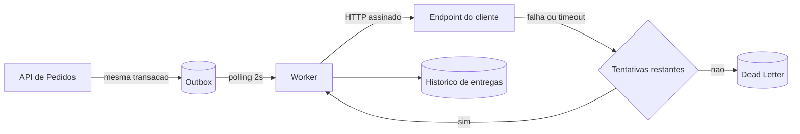

### RFC: Sistema de Webhooks de Notificação de Pedidos

Versão: 1.0
Data: 2026-07-29
Autor: Larissa (Tech Lead)
Status: Em revisão
Revisores: Marcos (Product Manager), Bruno (Engenheiro Pleno, time de Pedidos), Diego (Engenheiro Sênior, time de Plataforma), Sofia (Engenheira de Segurança)

> Este documento consolida a proposta técnica discutida na reunião registrada em [`TRANSCRICAO.md`](../TRANSCRICAO.md) e é submetido aos participantes para revisão. Referências no formato `[hh:mm]` remetem àquela transcrição; referências no formato `caminho/arquivo.ext` remetem ao código deste repositório. As decisões já fechadas estão formalizadas em [`docs/adrs/`](adrs/README.md) e não são reabertas aqui: o que esta revisão precisa validar é a proposta como conjunto e as questões listadas na seção "Questões em aberto".

---

### Resumo executivo (TL;DR)

Propomos construir a notificação outbound de mudanças de status de pedido sobre o padrão Transactional Outbox, usando o MySQL que já está em produção, sem introduzir infraestrutura nova.

Na prática: quando o status de um pedido muda, o evento é gravado em uma tabela de outbox dentro da mesma transação que já atualiza o pedido, grava o histórico e movimenta o estoque. Um worker em processo separado lê essa tabela a cada 2 segundos e entrega o evento por HTTP ao endpoint cadastrado pelo cliente, assinado com HMAC-SHA256 e uma secret exclusiva daquele endpoint. Falha de entrega gera até 5 tentativas com backoff exponencial de 1 minuto a 12 horas; esgotadas as tentativas, o evento vai para uma Dead Letter Queue persistida, reprocessável por endpoint administrativo.

A garantia oferecida é at-least-once: o evento sempre chega, pode chegar mais de uma vez, e sempre com o mesmo identificador, para que o cliente deduplique.

Ganhos: atomicidade entre a mudança de status e a emissão do evento, sem código de compensação; nenhum componente novo de infraestrutura para operar; entrega dentro da janela de 10 segundos que os clientes tratam como tempo real, já que o ciclo de leitura é de 2 segundos.

Custos: um segundo processo em produção, com supervisão própria; uma consulta e uma escrita adicionais no caminho crítico da mudança de status; e a transferência da deduplicação para o lado do cliente.

Estimativa de esforço declarada na reunião: **três sprints**, com os dois dias úteis de revisão de segurança incluídos no fim `[09:46]` `[09:47]`.

---

### Contexto e problema

Três clientes B2B, Atlas Comercial, MaxDistribuição e Nova Cargo, pediram formalmente para ser notificados quando o status dos pedidos deles muda. Hoje eles descobrem a mudança consultando a API de pedidos repetidamente, o que torna a integração lenta e cara do lado deles.

O pedido tem urgência comercial e não apenas mérito técnico: a Atlas sinalizou possibilidade de migrar para um concorrente caso a entrega não saia até o fim do trimestre. Isso define a feature como prioridade.

A aplicação não tem hoje nenhum mecanismo de notificação externa, evento ou fila.

O problema técnico central é o *dual write*. Gravar a mudança de status no banco e notificar um sistema externo são duas escritas em recursos diferentes, sem transação comum. Se a gravação tem sucesso e a notificação falha, o cliente nunca sabe da mudança. Se a notificação tem sucesso e a gravação é desfeita, o cliente sabe de algo que não aconteceu.

A abordagem mais direta, disparar a chamada HTTP dentro do método que muda o status, agrava o problema em vez de resolver. Essa transação já executa três escritas, e acoplá-la ao tempo de resposta de um sistema de terceiro significa que qualquer cliente lento passa a travar mudanças de status de outros pedidos. Além disso, um cliente fora do ar obrigaria a escolher entre desfazer uma operação de negócio legítima ou perder o evento `[09:04]`.

A meta de latência informada pelos clientes é folgada, e é ela que abre espaço para uma solução simples: eles consideram "tempo real" qualquer coisa abaixo de 10 segundos `[09:02]`.

---

### Proposta técnica

#### Visão geral

Notas do diagrama:

- A seta "mesma transacao" indica que a inserção na outbox participa da transação que já existe no serviço de pedidos: commit grava o evento, rollback o desfaz junto.
- Toda tentativa de entrega, bem ou malsucedida, alimenta o histórico consultável pelo cliente.

#### Componentes

**Emissão.** O serviço de pedidos passa a chamar, dentro do bloco transacional que já existe em `src/modules/orders/order.service.ts`, uma função de publicação que recebe a transação em curso. A escolha por função em vez de injeção de um repository inteiro foi justificada como o acoplamento menor entre os dois domínios `[09:41]`.

**Filtro na emissão.** Cada endpoint cadastrado assina uma lista de status que quer receber. Esse filtro é aplicado na inserção, e não no envio: se nenhum endpoint quer aquela transição, a linha nem chega a existir `[09:34]`. A consequência de desenho é que toda linha da outbox tem destinatário certo.

**Entrega.** Um segundo ponto de entrada de processo, análogo ao que já existe para subir a API em `src/server.ts`, executa o ciclo de leitura da outbox a cada 2 segundos. Ele abre o próprio cliente de banco, apontando para o mesmo banco da API `[09:30]`. Enquanto o worker for único, os eventos são processados em ordem de criação, o que entrega ordenação por pedido sem nenhum mecanismo de coordenação.

**Conteúdo do evento.** A linha da outbox guarda o conteúdo do evento já montado, e não apenas uma referência ao pedido `[09:52]`. Como a entrega pode acontecer horas depois do fato, montar o conteúdo no envio produziria eventos internamente contraditórios, anunciando uma transição com os dados de um estado posterior.

**Segurança do envio.** Cada requisição carrega a assinatura HMAC-SHA256 do corpo, calculada com uma secret exclusiva daquele endpoint `[09:22]`. Acompanha a assinatura o identificador único do evento, que é o que sustenta a deduplicação do lado do cliente. A URL cadastrada precisa usar TLS, verificação feita na validação de entrada `[09:23]`. A secret é rotacionável pela API, e a anterior permanece válida por 24 horas em paralelo.

**Resiliência.** O tempo limite da chamada ao cliente é de 10 segundos, e ausência de resposta nesse prazo conta como falha `[09:42]`. A progressão de retry é 1 minuto, 5 minutos, 30 minutos, 2 horas e 12 horas, somando quase 15 horas entre a primeira falha e a última tentativa `[09:17]`. Esgotadas as cinco, o evento vai para uma tabela dedicada de Dead Letter Queue, com o conteúdo, o motivo da falha e o horário. O reprocessamento é manual, por endpoint restrito a papel administrativo e com registro de quem executou `[09:36]`.

**Superfície de API.** Entram no escopo o CRUD de configuração de webhook por cliente, a rotação de secret, a consulta ao histórico de entregas de um endpoint e o reprocessamento administrativo da DLQ. O CRUD de configuração exige apenas autenticação; o reprocessamento exige papel administrativo. Os contratos, com payloads, cabeçalhos e códigos de status, estão especificados no FDD.

**Persistência.** Quatro tabelas novas: configuração de webhook por cliente, outbox de eventos, histórico de entregas e dead letter. A modelagem segue as convenções que o projeto já pratica, incluindo identificador no mesmo formato usado no resto do schema `[09:51]`.

#### Reuso do que já existe

A proposta não introduz nenhuma dependência nova no projeto `[09:29]`. O módulo de webhooks segue a mesma composição dos cinco módulos de domínio existentes; os erros estendem a hierarquia de `src/shared/errors/`, com códigos sob o prefixo `WEBHOOK_`; o tratador central de erro em `src/middlewares/error.middleware.ts` atende os erros novos sem nenhuma alteração; a autorização do reprocessamento reutiliza o mecanismo de papel de `src/middlewares/auth.middleware.ts`; o worker usa o mesmo logger estruturado do resto do projeto.

#### Fora do alcance desta proposta

- Aviso ao cliente, por e-mail ou outro canal, quando a integração dele está falhando repetidamente. Adiado para uma fase seguinte `[09:37]`, e tratado em QA-05.
- Painel visual para o cliente acompanhar os webhooks dele. É projeto separado, do time de frontend `[09:40]`.
- Webhooks de entrada. O escopo é exclusivamente outbound `[09:02]`.
- Política de arquivamento das linhas já entregues, declarada fora do escopo desta feature `[09:08]`, e tratada em QA-03.

---

### Alternativas consideradas

#### 1. Disparo HTTP síncrono dentro da transação de mudança de status

**Descrição:** notificar o cliente no próprio instante do commit, sem intermediário, aproveitando o fluxo que já existe.

**Motivo do descarte:** acopla a duração de uma transação de negócio ao tempo de resposta de um sistema de terceiro, mantendo locks de banco abertos durante uma chamada de rede. O trade-off decisivo é o comportamento sob falha: com o cliente fora do ar, a única saída seria desfazer uma mudança de status legítima `[09:04]`.

#### 2. Redis Streams ou outro broker dedicado

**Descrição:** usar uma fila intermediária feita para o problema, com grupos de consumo e escala horizontal nativos.

**Motivo do descarte:** não resolve o problema que motivou a discussão. Gravar no MySQL e publicar no broker continuam sendo duas escritas independentes, ou seja, o mesmo dual write, agora com um componente a mais para operar. Classificado como overengineering para o tamanho do time `[09:07]`.

#### 3. Trigger de banco notificando o worker

**Descrição:** tornar o desenho reativo em vez de baseado em consulta repetida, com o banco avisando quando surge evento novo `[09:09]`.

**Motivo do descarte:** o MySQL não tem mecanismo nativo de notificação para processo externo, ao contrário do PostgreSQL. Trigger no MySQL executa SQL e nada mais. Qualquer contorno colocaria efeito colateral externo dentro de uma transação de banco, e regra de entrega dentro do banco, longe do código da aplicação.

#### 4. Worker dentro do processo da API

**Descrição:** executar o ciclo de leitura da outbox como rotina interna da aplicação, dispensando um segundo processo.

**Motivo do descarte:** amarra o ciclo de vida da entrega ao da API, de modo que um restart da API interrompe a entrega de eventos `[09:11]`. Como efeito lateral, múltiplas instâncias da API produziriam múltiplos leitores concorrentes da outbox, o que quebra a ordenação por pedido que a proposta oferece.

#### 5. Três tentativas de entrega, em vez de cinco

**Descrição:** política de retry mais agressiva, com teto mais baixo `[09:16]`.

**Motivo do descarte:** três tentativas cobrem cerca de 30 minutos, e a plataforma já teve cliente com indisponibilidade de duas horas em manutenção planejada. A janela mais curta declararia falha permanente em um caso que a operação já viu acontecer e se resolver sozinho.

#### 6. Retry indefinido, sem teto de tentativas

**Descrição:** nunca desistir de um evento, mantendo o backoff crescente indefinidamente `[09:15]`.

**Motivo do descarte:** um cliente que desapareceu de vez deixa o evento pendurado para sempre, com acumulação permanente na outbox. Sem teto também não existe o momento em que a falha vira registro em Dead Letter, que é o que a torna consultável e reprocessável.

#### 7. Secret única e global da plataforma

**Descrição:** uma credencial de assinatura só, compartilhada por todos os clientes, dispensando a modelagem de ciclo de vida de credencial por endpoint.

**Motivo do descarte:** vazamento em um único cliente comprometeria a comunicação com todos, formulado na reunião como "se vaza uma, vaza tudo" `[09:21]`. Havia caso concreto conhecido de cliente que expôs credencial em log de aplicação `[09:22]`.

#### 8. Entrega exactly-once

**Descrição:** eliminar a duplicidade na origem, coordenando com o cliente a confirmação de processamento, e não apenas a de transporte.

**Motivo do descarte:** exigiria protocolo de confirmação com estado distribuído entre organizações diferentes, e o cliente precisaria implementar corretamente o lado dele para a garantia valer. Custo desproporcional ao benefício, contra um padrão de mercado consolidado que resolve a quase totalidade dos casos `[09:25]`.

---

### Questões em aberto

Os pontos abaixo foram levantados na reunião e deliberadamente não decididos. Nenhum bloqueia o início da implementação, mas todos precisam de dono e de momento de revisão.

#### QA-01. Rate limiting de saída por cliente

Se um cliente tem 50 pedidos mudando de status em um minuto, a plataforma envia 50 chamadas para o endpoint dele. Diego levantou o ponto em `[09:38]`, e a própria proposta de adiamento veio dele: observar e implementar apenas se virar problema real `[09:39]`. Fica registrado como ponto em aberto, e não como decisão de não fazer.

**O que destravaria a decisão:** dados de volume de envio por endpoint depois da entrada em produção.

#### QA-02. Escala do worker além de uma instância

A ordenação por pedido e a ausência de coordenação entre leitores dependem de o worker permanecer único. Escalar exige antes escolher entre particionar por pedido e usar lock pessimista, e a reunião classificou explicitamente isso como problema do futuro `[09:13]`.

**O que destravaria a decisão:** evidência de que uma instância não dá conta da vazão, medida pela profundidade da fila de pendentes.

#### QA-03. Política de retenção e arquivamento da outbox

O arquivamento das linhas já entregues foi estimado em torno de 30 dias e colocado fora do escopo desta feature `[09:08]`. O número não foi fechado e nenhum mecanismo foi definido. A decisão de guardar o conteúdo do evento na própria linha torna essa pendência mais sensível, porque a tabela cresce mais rápido do que cresceria com apenas uma referência.

**O que destravaria a decisão:** taxa de crescimento observada da tabela e definição de quanto tempo o histórico precisa ficar consultável.

#### QA-04. Endurecimento das permissões do CRUD de configuração

O reprocessamento da DLQ exige papel administrativo, mas o CRUD de configuração de webhook aceita qualquer papel autenticado. Perguntado diretamente por Marcos em `[09:36]`, Sofia respondeu que por enquanto sim, e que mais adiante isso pode ser endurecido `[09:37]`.

**O que destravaria a decisão:** definição de produto sobre quem, do lado do cliente, pode alterar a configuração de entrega.

#### QA-05. Aviso ao cliente sobre integração quebrada

Sem notificação ativa, o cliente só descobre que sua integração está falhando consultando o histórico de entregas. A alternativa de aviso por e-mail após falhas repetidas foi proposta por Marcos e adiada por Larissa para uma fase seguinte, depois de medir o impacto `[09:37]`.

**O que destravaria a decisão:** medição de quantas integrações efetivamente quebram e por quanto tempo permanecem quebradas sem alguém perceber.

---

### Impacto e riscos

#### Impacto no sistema existente

A alteração crítica é uma só, e é no caminho mais sensível da aplicação: o método que muda o status do pedido em `src/modules/orders/order.service.ts` passa a inserir o evento dentro da transação que já mantém. Isso é intencional e é a garantia central da proposta, mas transforma o domínio de webhooks em dependência do fluxo de pedidos. Uma falha ao gravar o evento desfaz a mudança de status `[09:40]`.

Fora desse ponto, o impacto sobre o código existente é aditivo: um módulo novo, um segundo ponto de entrada de processo e quatro tabelas novas, sem nenhuma alteração no tratador de erro nem no mecanismo de autorização. A única exceção é a configuração do logger, que precisa passar a omitir a secret do webhook, conforme o risco R3.

Do lado operacional, a plataforma passa a ter um processo de execução contínua, o primeiro do projeto. Ele precisa de empacotamento, supervisão, log e alarme próprios.

#### Riscos

**R1. Worker único como ponto único de falha.** Se o worker morre e ninguém percebe, os eventos acumulam silenciosamente na outbox, sem nenhum erro visível na API. Mitigação: alarme sobre a profundidade da fila de eventos pendentes, que é a métrica que denuncia a parada. Consequência direta e aceita de [ADR-002](adrs/ADR-002-worker-em-processo-separado-com-polling.md).

**R2. Concentração de tentativas após indisponibilidade de um cliente.** A progressão de backoff é fixa e igual para todos os eventos, sem componente aleatório. Quando um cliente fica fora do ar e muitos eventos falham juntos, todos voltam a tentar nos mesmos instantes, concentrando picos sobre um sistema que está justamente se recuperando. Mitigação possível dentro da política já decidida: processar em lotes pequenos por ciclo. Registrado como consequência em [ADR-003](adrs/ADR-003-retry-com-backoff-e-dlq.md).

**R3. Custódia de credencial.** A plataforma passa a guardar uma secret por endpoint, algo que hoje ela não faz para nenhum terceiro. Vazamento em log, em resposta de API ou em mensagem de erro permite forjar assinatura válida. Mitigação: estender a lista de campos omitidos em log, já existente em `src/shared/logger/index.ts`, e garantir que a secret só apareça na resposta de criação e na de rotação.

**R4. Cliente que não deduplica.** A garantia at-least-once transfere a deduplicação para o cliente, e a plataforma não tem como verificar se ele a implementou. O incidente ocorre no domínio dele e chega como reclamação para a plataforma. Mitigação: documentação destacada no portal do desenvolvedor, assumida por Marcos em `[09:26]`.

**R5. Prazo.** A estimativa é de três sprints `[09:46]`, o compromisso comercial é fim de novembro `[09:45]` e o risco de perda de cliente está atrelado ao fim do trimestre `[09:00]`. A revisão de segurança de dois dias úteis é pré-requisito de deploy e está no fim do cronograma `[09:46]`, de modo que qualquer atraso acumulado nas sprints anteriores a comprime.

---

### Decisões relacionadas

As decisões abaixo já estão fechadas e formalizadas. Esta proposta as consolida, não as reabre.

| ADR | Decisão | Fechada por |
|---|---|---|
| [ADR-001](adrs/ADR-001-outbox-no-mysql.md) | Emissão de eventos via padrão Outbox no MySQL | Larissa `[09:08]` |
| [ADR-002](adrs/ADR-002-worker-em-processo-separado-com-polling.md) | Worker em processo separado com polling de 2 segundos | Larissa `[09:10]` e `[09:11]` |
| [ADR-003](adrs/ADR-003-retry-com-backoff-e-dlq.md) | Backoff exponencial de 5 tentativas e DLQ persistida | Larissa `[09:17]` |
| [ADR-004](adrs/ADR-004-hmac-sha256-secret-por-endpoint.md) | HMAC-SHA256 com secret por endpoint e rotação | Sofia `[09:22]` |
| [ADR-005](adrs/ADR-005-at-least-once-com-x-event-id.md) | Entrega at-least-once com deduplicação pelo cliente | Larissa `[09:26]` |
| [ADR-006](adrs/ADR-006-reuso-dos-padroes-do-projeto.md) | Reuso dos padrões já existentes na codebase | Larissa `[09:30]` |
| [ADR-007](adrs/ADR-007-snapshot-do-payload-na-outbox.md) | Snapshot do conteúdo do evento na inserção | Larissa `[09:52]` |
| [ADR-008](adrs/ADR-008-filtro-de-eventos-na-insercao.md) | Filtro de eventos aplicado na inserção | Bruno `[09:34]` |

Documentos complementares: o [PRD](PRD.md) cobre o problema de produto, o escopo e as métricas de sucesso; o [FDD](FDD.md) detalha fluxos, contratos, matriz de erros e integração com o código existente; o [TRACKER](TRACKER.md) mapeia cada item destes documentos à sua origem na transcrição ou no código.

---

### O que esta revisão precisa de vocês

- **Bruno e Diego:** validação da proposta técnica como conjunto, com atenção ao ponto de integração no serviço de pedidos e ao desenho do processo do worker.
- **Sofia:** confirmação de que o bloco de segurança está fielmente registrado, e agendamento dos dois dias úteis de revisão antes do deploy.
- **Marcos:** confirmação do escopo, dos itens adiados e do compromisso de documentação no portal do desenvolvedor.
- **Todos:** priorização das questões em aberto QA-01 a QA-05, definindo quais precisam de dono agora e quais podem esperar a entrada em produção.
